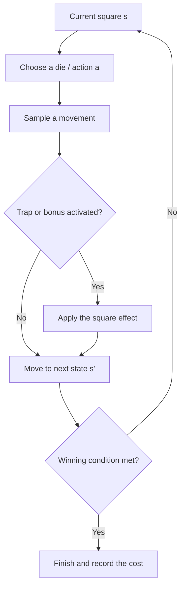

# Markov Decision Processes for Snakes and Ladders

A Python implementation of sequential decision-making methods for a stochastic Snakes and Ladders environment. The project compares model-based planning, empirical simulation and model-free reinforcement learning.

**[Read the complete project report](https://github.com/yassinedkk/LDAT2M/blob/main/portfolio/markov-decision-processes/report.pdf)**

## Project overview

The game is represented as a Markov Decision Process (MDP) with 15 board squares. Square 1 is the start and square 15 is the goal. At each non-terminal square, the player chooses one of three dice:

| Die | Possible moves | Probability per move | Trap or bonus activation |
|---|---:|---:|---:|
| Security | 0 or 1 | 1/2 | Never |
| Normal | 0, 1 or 2 | 1/3 | 50% |
| Risky | 0, 1, 2 or 3 | 1/4 | 100% |

The objective is to select the die that minimizes the expected number of turns needed to reach the goal from every square.

## Board layout


*The board starts at square 1 and splits after square 3. The slow lane follows squares 4 to 10, while the fast lane follows squares 11 to 14; both paths end at square 15.*

## How the project works



Value iteration uses the known transition model to find the minimum-cost action in every state. Monte Carlo simulations then validate those theoretical costs, while Q-learning learns a policy through repeated interaction with the same environment.

## Board and environment rules

- The board contains 15 squares; the returned policy covers squares 1 to 14 because square 15 is terminal.
- Square 3 is a junction. When leaving it, the player has equal probability of entering the slow or fast lane.
- Traps and bonuses activate only when the player stops exactly on their square.
- With the normal or risky die, rolling 0 can activate the trap or bonus on the current square.
- A teleport does not cause cascade activation on the destination square.
- A penalty trap less than three squares from the start sends the player back to square 1.
- After activating a bonus, the player may freely choose any die for the extra turn.
- Squares 1 and 15 cannot contain a trap or bonus.

### Square types

| Layout value | Square type | Effect |
|---:|---|---|
| 0 | Ordinary | No additional effect |
| 1 | Restart | Return immediately to square 1 |
| 2 | Penalty | Move three squares backward |
| 3 | Prison | Lose the next turn |
| 4 | Bonus | Play another turn immediately |

### Winning scenarios

- `circle=True`: the player must land exactly on square 15; overstepping the goal returns the player to the beginning of the circular board.
- `circle=False`: landing on or overstepping square 15 ends the game.

## Markov Decision Process

A state is the player's current square, an action is the selected die, and the cost of a standard action is one turn. The optimal value satisfies the Bellman equation:

```math
V^*(s) = \min_{a \in A(s)}
\left[
c(s,a) + \sum_{s'} P(s' \mid s,a)V^*(s')
\right].
```

The implementation repeatedly updates the state values until the largest change is below `1e-6`, then selects the least-cost action for each state.

## Required function

The assignment requires the following Python interface:

```python
markovDecision(layout, circle)
```

| Element | Meaning |
|---|---|
| `layout` | NumPy array of 15 integers encoding ordinary, trap and bonus squares |
| `circle` | Boolean selecting the exact-landing or overstepping rule |
| `Expec` | Expected number of turns from each of the 14 non-terminal squares |
| `Dice` | Optimal die for each square: 1 = security, 2 = normal, 3 = risky |
| Return value | `[Expec, Dice]` |

## Methods and experiments

- construction of action-dependent transition probabilities;
- Bellman optimality and value iteration;
- optimal-policy extraction;
- Monte Carlo validation using 10,000 simulated games;
- comparison with security-only, normal-only, risky-only and random policies;
- experiments with different trap layouts and both winning scenarios;
- tabular Q-learning with epsilon-greedy exploration;
- comparison of theoretical, simulated and learned state costs.

## Repository structure

```text

├── assets/
│   └── board-layout.png
├── README.md
├── requirements.txt
├── report.pdf
└── snake_game.py
```

- `snake_game.py` contains the original implementation used for the coursework.
- `report.pdf` contains the original six-page group report with all student identification numbers removed.
- `requirements.txt` lists the Python dependencies.

## Run the project

Requires Python 3.10 or later.

```bash
python -m venv .venv
source .venv/bin/activate
pip install -r requirements.txt
python snake_game.py
```

On Windows PowerShell, activate the environment with:

```powershell
.venv\Scripts\Activate.ps1
```

The script prints the converged policies and opens figures comparing theoretical costs, simulated costs, alternative strategies and Q-learning.

## Skills demonstrated

Python, NumPy, Matplotlib, stochastic modelling, Markov Decision Processes, dynamic programming, value iteration, reinforcement learning, Monte Carlo simulation, numerical convergence and statistical visualization.

## Authors

- Gaetan Berlaimont
- Benoit Henrion
- Yassine Zeamari

Academic group project for LINFO2275 - Data Mining and Decision Making, UCLouvain, 2024-2025.


> **Project archive:** Large binary artifacts are available in the [original portfolio folder](https://github.com/yassinedkk/LDAT2M/tree/main/portfolio/markov-decision-processes).
